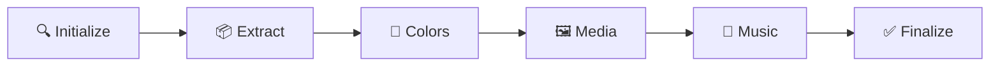

<div align="center">

# 🎨 RUIE
### RSI Launcher UI Editor

[](https://github.com)
[](https://github.com)
[](LICENSE)
[](https://www.python.org)

**Transform your RSI Launcher with custom themes, colors, and media**

*A powerful Windows desktop application built with Python (Flask + PyQt5) featuring a complete 6-step wizard for theme creation with live preview.*

✅ **SAFE FOR DISTRIBUTION** - All security vulnerabilities fixed and verified

⚠️ **DISCLAIMER:** This is a fan-made project and is NOT affiliated with Cloud Imperium Games or Star Citizen. Star Citizen is a registered trademark of Cloud Imperium Games. This tool is provided for personal use only.

💡 **DEVELOPMENT NOTE:** This application was developed with AI assistance using GitHub Copilot (Claude Haiku 4.5).

[🚀 Quick Start](#-quick-start) • [✨ Features](#-features) • [🎨 Color Presets](#-color-customization) • [📖 Documentation](#-documentation) • [🐛 Troubleshooting](#-troubleshooting)

---

</div>

---

## ✨ Features

<table>
<tr>
<td width="50%">

### 🎯 Core Features
- ✅ **6-Step Wizard** - Streamlined workflow
- 👁️ **Live Preview** - Real-time theme updates
- ✅ **17 Professional Presets** - Ready-to-use manufacturer themes
- 🔧 **54 Color Variables** - 27 colors + RGB variants for complete customization
- 🖼️ **Media Replacement** - Images & videos
- 🎵 **Music Playlist** - Custom background audio
- ⚡ **Progress Feedback** - Visual startup progress with percentage and status messages

</td>
<td width="50%">

### ⚡ Advanced Features
- 🔍 **Auto-Detection** - Finds launcher automatically
- 💾 **Backup & Recovery** - Save themes, restore easily
- 🔄 **Extraction Management** - Create, reuse, delete extractions
- 🛡️ **Admin Support** - Automatic UAC elevation
- 📊 **Debug Logging** - Built-in troubleshooting
- 📱 **Responsive Design** - All screen sizes
- 🚀 **Smart Startup** - Real-time progress bar, status updates, timeout protection

</td>
</tr>
</table>

---

## 💻 System Requirements

| Component | Requirement |
|-----------|-------------|
| **OS** | Windows 10/11 (with Administrator privileges) |
| **Python** | 3.10+ *(only for running from source)* |
| **Node.js** | Latest *(for app.asar extraction/repacking)* |
| **Disk Space** | ~500MB (for extraction & backups) |

---

## 🚀 Quick Start

### 📦 Option 1: Install Using Windows Installer *(Recommended for Users)*

```bash
1. Download RUIE-0.2-Alpha-Installer.exe from Releases
2. Double-click to run the installer
3. Click "Yes" when Windows asks for admin permission
4. Follow the installation wizard
5. App launches automatically when done
```

**Benefits:**
- Professional installation experience
- Start Menu shortcuts
- Easy uninstallation
- Automatic updates ready

---

### 🎮 Option 2: Run Portable Executable

```bash
1. Download RUIE.exe from Releases or dist/ folder
2. Double-click to launch (no installation needed)
3. Click "Yes" when UAC prompts for admin privileges
4. Follow the 6-step wizard
```

**Benefits:**
- No installation required
- Works from USB drives
- Easy to remove
- ~300MB total

---

### 👨‍💻 Option 3: Run from Source Code

```bash
# Install dependencies
pip install -r requirements.txt

# Launch the app
python launcher.py
# OR use the batch file
run.bat
```

**Benefits:**
- Full source code access
- Easy to modify
- Good for development

---

### 🔨 Option 4: Build Your Own Installer

```bash
# Requires Inno Setup 6 (https://jrsoftware.org/isdl.php)
build_installer.bat
# Creates: dist\RUIE-0.2-Alpha-Installer.exe
```

For detailed installation instructions, see [INSTALL_GUIDE.md](INSTALL_GUIDE.md)

---

## 📋 Usage Workflow



| Step | Description | Features |
|------|-------------|----------|
| **1️⃣ Initialize** | Locate RSI Launcher | Auto-detection, manual path selection |
| **2️⃣ Extract** | Unpack app.asar | Progress tracking, reuse existing extractions |
| **3️⃣ Colors** | Customize theme colors | 17 presets, 54 variables, live preview |
| **4️⃣ Media** | Replace visual assets | Grid picker, images & videos |
| **5️⃣ Music** | Manage audio tracks | Add/remove/reorder playlist |
| **6️⃣ Finalize** | Deploy your theme | Test temporarily or install permanently |

---

## 🎨 Color Customization

### 🌈 Professional Presets

Choose from **17 carefully crafted manufacturer-themed color schemes**:

<table>
<tr>
<td width="33%">

#### 🔵 RSI Original
*Official RSI launcher*
- Classic blue accents `#54adf7`
- Professional dark background
- Default Star Citizen theme

</td>
<td width="33%">

#### 🔵 Aegis Dynamics
*Military precision*
- Deep space blue `#0a1220`
- Navy accents `#4169a8`
- Military aesthetic

</td>
<td width="33%">

#### 🟠 Anvil Aerospace
*Industrial strength*
- Dark industrial `#2a2e34`
- Signature orange `#e84a1f`
- Bold and rugged

</td>
</tr>

<tr>
<td width="33%">

#### 🔵 Origin Jumpworks
*Luxury refinement*
- Premium dark blue `#162e42`
- Cyan accents `#00d4ff`
- Elegant and sleek

</td>
<td width="33%">

#### 🟡 Drake Interplanetary
*Pirate's choice*
- Gritty dark tones `#1a1a14`
- Golden yellow `#f5b800`
- Rough and ready

</td>
<td width="33%">

#### 🔵 Crusader Industries
*Sky pioneers*
- Deep ocean `#14282f`
- Turquoise `#10d9c5`
- Aviation heritage

</td>
</tr>

<tr>
<td width="33%">

#### 🟢 MISC
*Civilian excellence*
- Military green `#1a2012`
- Lime highlights `#9fdf3f`
- Industrial reliability

</td>
<td width="33%">

#### 🟠 Consolidated Outland
*Modern innovation*
- Warm earth tones `#221e19`
- Orange glow `#ff8c42`
- Contemporary style

</td>
<td width="33%">

#### 🟣 Banu
*Alien mystique*
- Deep purple `#1c1426`
- Violet accents `#a855f7`
- Exotic design

</td>
</tr>

<tr>
<td width="33%">

#### 🟢 Esperia
*Tevarin heritage*
- Forest darkness `#1b241f`
- Emerald green `#34d399`
- Ancient alien tech

</td>
<td width="33%">

#### 🟣 Kruger Intergalactic
*Precision engineering*
- Dark violet `#201c26`
- Magenta `#e879f9`
- Technical excellence

</td>
<td width="33%">

#### 🟡 Argo Astronautics
*Workhorse reliability*
- Industrial brown `#241f14`
- Amber yellow `#fbbf24`
- Utilitarian design

</td>
</tr>

<tr>
<td width="33%">

#### 🔵 Aopoa
*Xi'an elegance*
- Alien blue `#141e2b`
- Cyan glow `#22d3ee`
- Sophisticated alien tech

</td>
<td width="33%">

#### 🟤 Tumbril Land Systems
*Ground force*
- Military earth `#221c12`
- Combat brown `#92400e`
- Tactical durability

</td>
<td width="33%">

#### ⚫ Greycat Industrial
*Budget utilitarian*
- Neutral grays `#23231e`
- Steel tones `#71717a`
- Functional simplicity

</td>
</tr>

<tr>
<td width="33%">

#### 🔴 Vanduul
*Enemy aesthetic*
- Blood red darkness `#260c0c`
- Crimson alerts `#dc2626`
- Hostile threat

</td>
<td width="33%">

#### 🟢 Gatac Manufacture
*Xi'an military*
- Military olive `#1c2214`
- Lime green `#84cc16`
- Alien combat systems

</td>
<td width="33%">

#### 🔴 C3RB
*Custom dark red*
- Deep crimson base
- Red accent colors
- Community favorite

</td>
</tr>
</table>

### 🎛️ Manual Customization

- **54 CSS Variables** - Fine-tune every color (27 colors + RGB variants)
- **Organized Sections** - Primary, Neutral, Accent, Status, Interactive, and more
- **Dual Input Modes** - Hex codes or RGB sliders
- **Live Preview** - See changes instantly
- **Color Persistence** - Retained while navigating steps

---

## 🏗️ Architecture

### 🔄 Dual-Mode Server Design

<table>
<tr>
<td width="50%">

**🛠️ Development Mode** *(from source)*
- Flask server as separate subprocess
- Live reloading enabled
- Output streams captured for logging
- Ideal for debugging

</td>
<td width="50%">

**📦 Production Mode** *(compiled EXE)*
- Flask runs in daemon thread
- No external Python required
- Resources from PyInstaller temp
- Reloader disabled for stability

</td>
</tr>
</table>

### 🗂️ Resource Path Resolution
| Mode | Path Source | Purpose |
|------|-------------|---------|
| **Frozen** | `sys._MEIPASS` | Bundled resources in temp folder |
| **Source** | Script directory | Local development files |

### 📝 Logging System
```
📁 Documents/RUIE-debug.log
├─ 📊 Level: DEBUG (captures all operations)
├─ ⏰ Format: Timestamp + Level + Message
├─ 🔍 Full tracebacks for errors
└─ 💡 Use: Troubleshooting & development
```

### 🛡️ Error Handling
- ✅ Flask endpoints with try-catch blocks
- ✅ Individual file processing with error isolation
- ✅ Detailed error messages to frontend
- ✅ Full stack traces in logs

---

## 💾 Theme Management

### 📂 File Locations

| Type | Location |
|------|----------|
| 🐛 **Debug Log** | `C:\Users\<You>\Documents\RUIE-debug.log` |
| 📦 **Extracted Files** | `C:\Users\<You>\Documents\RSI-Launcher-Theme-Creator\app-extracted-YYYYMMDD-HHMMSS\` |
| 💾 **Backups** | `C:\Users\<You>\Documents\RSI-Launcher-Theme-Creator\backup-YYYYMMDD-HHMMSS\` |
| 🎨 **Saved Themes** | `C:\Users\<You>\Documents\RSI-Launcher-Theme-Creator\themes\` |
| 🚀 **RSI Launcher** | `C:\Program Files\Roberts Space Industries\RSI Launcher\resources\app.asar` |

### 🔄 Save & Share Themes

| Action | Icon | Description |
|--------|------|-------------|
| **Save Theme** | 💾 | Save locally for later use |
| **Export Theme** | 📤 | Download `.theme.json` to share |
| **Import Theme** | 📥 | Load community themes |
| **Load Saved** | 📂 | Browse previously saved themes |

> 💡 **Tip**: Theme files (`.theme.json`) are portable! Share them on Discord, Reddit, or any platform.

---

## 🐛 Troubleshooting

<details>
<summary><b>🟢 App Stuck at "Starting..."</b> <i>(FIXED in Feb 1, 2026)</i></summary>

- **Status**: ✅ Fixed in latest version
- **If still occurring**: Rebuild the EXE using `build.bat`
- **Check**: `Documents\RUIE-debug.log` for detailed error information

</details>

<details>
<summary><b>🟢 Color Application Crashes</b> <i>(FIXED in Feb 1, 2026)</i></summary>

- **Status**: ✅ Fixed with enhanced error handling
- **Check**: `Documents\RUIE-debug.log` for specific error details
- **Common cause**: Extraction directory not set or doesn't exist
- **Solution**: Re-run extraction step before applying colors

</details>

<details>
<summary><b>📊 Debug Logging</b></summary>

- **Location**: `C:\Users\<YourName>\Documents\RUIE-debug.log`
- **Purpose**: Captures all application events, errors, and server activity
- **When to check**: Any time the app behaves unexpectedly
- **Auto-created**: New log file created each time the app starts

</details>

<details>
<summary><b>🔒 "Permission Denied" Error</b></summary>

- Run the application as Administrator
- Use `launch.bat` which automatically requests elevation
- The compiled EXE automatically requests UAC elevation on startup

</details>

<details>
<summary><b>🔍 "Launcher Not Found" Error</b></summary>

- Ensure RSI Launcher is installed in default location: `C:\Program Files\Roberts Space Industries\RSI Launcher\`
- Use the manual path selection in Step 1
- Verify the launcher is properly installed and updated

</details>

<details>
<summary><b>🔨 Build Fails with PyInstaller Errors</b></summary>

- Ensure Python 3.10+ is installed
- Run `build.bat` from the project directory
- Delete `build/` and `dist/` folders and try again
- Verify all dependencies are installed: `pip install -r requirements.txt`

</details>

<details>
<summary><b>🌐 "Failed to fetch" Errors</b></summary>

- **Cause**: Flask server stopped or not responding
- **Check**: `Documents\RUIE-debug.log` for server errors
- **Solution**: Close and restart the app
- **Port conflict**: Ensure port 5000 is not in use by another application

</details>

<details>
<summary><b>🚀 Server Won't Start</b></summary>

- Confirm Python and Flask are installed: `pip install -r requirements.txt`
- Ensure port 5000 is free
- Ensure Node.js is installed for `npx asar` operations
- Check debug log for specific startup errors
- Try running with administrator privileges

</details>

---

## 🔧 Development

### 📁 File Structure

```
RUIE/
├── 🐍 launcher.py           # PyQt5 GUI entry point
├── 🌐 server.py             # Flask API server (25+ endpoints)
├── 🎨 color_replacer.py     # Color replacement engine
├── 🖼️ media_replacer.py     # Media file replacement
├── 🔍 launcher_detector.py  # Auto-detect RSI Launcher
├── 🚀 launch.bat            # Clean launcher with UAC
├── 🛠️ run.bat               # Development launcher
├── 🔨 build.bat             # Build standalone EXE
├── 🎯 icon.ico              # Application icon
├── 📦 requirements.txt      # Python dependencies
├── 📋 requirements-build.txt # Build dependencies
└── 📂 public/               # Web assets
    ├── app.js               # Main application logic (1400+ lines)
    ├── preview.html         # Live preview iframe
    ├── styles.css           # UI styling (700+ lines)
    └── assets/              # Images, logos, sounds, videos
```

### 🛠️ Modify & Build

```bash
# 1. Edit source code
#    - launcher.py (GUI)
#    - server.py (API)
#    - public/ (web assets)

# 2. Test changes
python launcher.py

# 3. Build for distribution
build.bat
```

---

## 📖 Documentation

- 📘 [QUICKSTART.md](QUICKSTART.md) - Quick reference guide
- 📙 [CHANGELOG.md](CHANGELOG.md) - Version history & updates
- 📕 [LICENSE](LICENSE) - GPL v3.0 license details

---

## 📜 License

**GNU General Public License v3.0**

This project is free software: you can redistribute it and/or modify it under the terms of the GNU General Public License as published by the Free Software Foundation, either version 3 of the License, or (at your option) any later version.

See [LICENSE](LICENSE) for full details.

---

<div align="center">

### ⚠️ Admin Privileges Required

The app requires Administrator permissions for:

✅ Writing to `Program Files\Roberts Space Industries\RSI Launcher\`  
✅ Deploying themes permanently to the launcher  
✅ Test launcher functionality (temporary file modifications)

**To run with admin**: Right-click `run.bat` → "Run as administrator"  
*Or simply double-click the compiled EXE (auto-requests UAC elevation)*

---

### 🌟 Star Citizen Community

Made with ❤️ for the Star Citizen community

*Transform your launcher experience today!*

</div>
